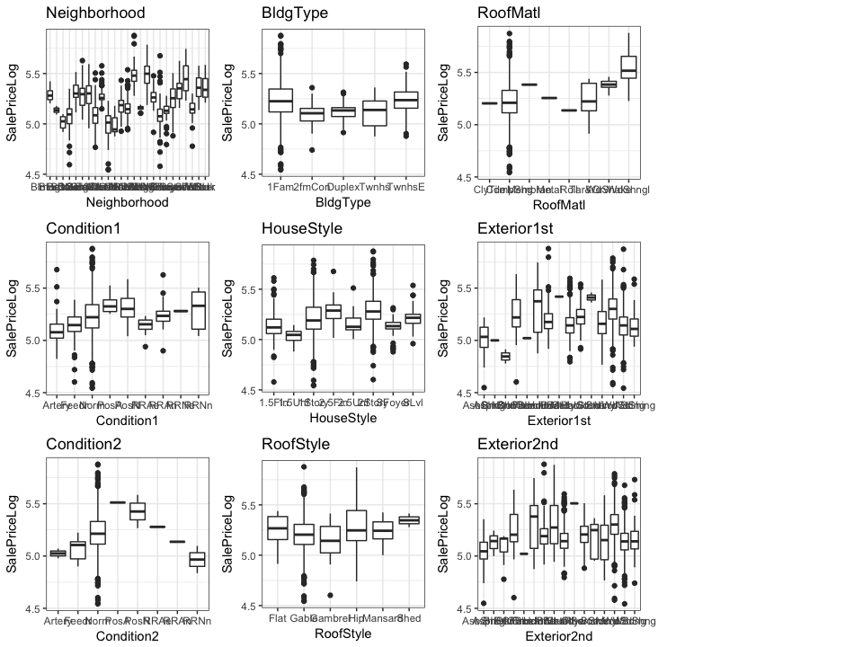
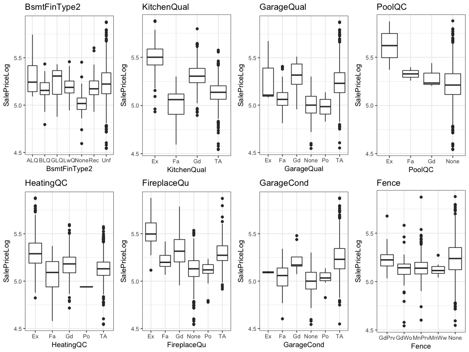

project ivy: House Prices (Kaggle) - EDA
================

Overview
--------

[House Prices: Advanced Regression Techniques](https://www.kaggle.com/c/house-prices-advanced-regression-techniques)

Let's get a feel for the data
-----------------------------

Let's load the data and implement the rules based on **data\_description.txt** and inspect the data

    ## Rows Cols 
    ## 2919   82

    ##        Variable Missing
    ## 1      MSZoning       4
    ## 2   LotFrontage     486
    ## 3     Utilities       2
    ## 4   Exterior1st       1
    ## 5   Exterior2nd       1
    ## 6    MasVnrType      24
    ## 7    MasVnrArea      23
    ## 8    BsmtFinSF1       1
    ## 9    BsmtFinSF2       1
    ## 10    BsmtUnfSF       1
    ## 11  TotalBsmtSF       1
    ## 12   Electrical       1
    ## 13 BsmtFullBath       2
    ## 14 BsmtHalfBath       2
    ## 15  KitchenQual       1
    ## 16   Functional       2
    ## 17  GarageYrBlt     159
    ## 18   GarageCars       1
    ## 19   GarageArea       1
    ## 20     SaleType       1
    ## 21    SalePrice    1459

There are 21 variables containing NA's. Note the following:

-   **SalesPrice** is missing because the **test** data was merged with the **train** data. That leaves us with 20 variables containing NA's.
-   **GarageYrBlt** will be NA if there is no garage on the property

Let's visualise missing 

    ##    Variable Missing
    ## 1 SalePrice    1459

Visualisation
-------------

Notice **SalePrice** vs **SalePriceLog**. We'll be using **SalePriceLog** from now on.

    ## `stat_bin()` using `bins = 30`. Pick better value with `binwidth`.
    ## `stat_bin()` using `bins = 30`. Pick better value with `binwidth`.

Box plots

    
