project ivy: House Prices (Kaggle) - EDA
================

Overview
--------

[House Prices: Advanced Regression Techniques](https://www.kaggle.com/c/house-prices-advanced-regression-techniques)

Let's get a feel for the data
-----------------------------

Let's load the data and implement the rules based on **data\_description.txt** and inspect the data

    ## Rows Cols 
    ## 2919   82

    ##        Variable Missing
    ## 1      MSZoning       4
    ## 2   LotFrontage     486
    ## 3     Utilities       2
    ## 4   Exterior1st       1
    ## 5   Exterior2nd       1
    ## 6    MasVnrType      24
    ## 7    MasVnrArea      23
    ## 8    BsmtFinSF1       1
    ## 9    BsmtFinSF2       1
    ## 10    BsmtUnfSF       1
    ## 11  TotalBsmtSF       1
    ## 12   Electrical       1
    ## 13 BsmtFullBath       2
    ## 14 BsmtHalfBath       2
    ## 15  KitchenQual       1
    ## 16   Functional       2
    ## 17  GarageYrBlt     159
    ## 18   GarageCars       1
    ## 19   GarageArea       1
    ## 20     SaleType       1
    ## 21    SalePrice    1459

There are 21 variables containing NA's. Note the following:

-   **SalesPrice** is missing because the **test** data was merged with the **train** data. That leaves us with 20 variables containing NA's.
-   **GarageYrBlt** will be NA if there is no garage on the property

Let's visualise missing 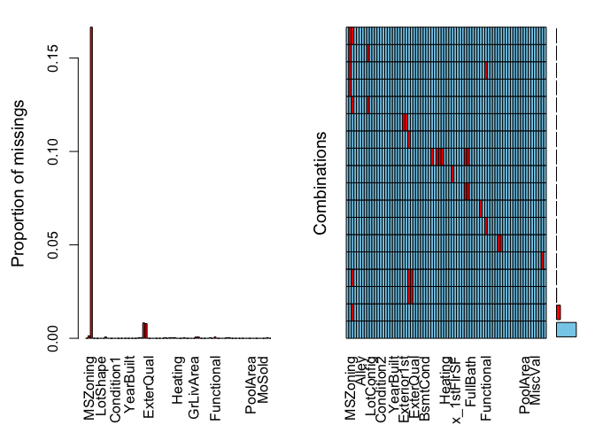

    ##      Variable Missing
    ## 1 GarageYrBlt     159
    ## 2   SalePrice    1459

Visualisation
-------------

Notice **SalePrice** vs **SalePriceLog**. We'll be using **SalePriceLog** from now on.

    ## `stat_bin()` using `bins = 30`. Pick better value with `binwidth`.
    ## `stat_bin()` using `bins = 30`. Pick better value with `binwidth`.

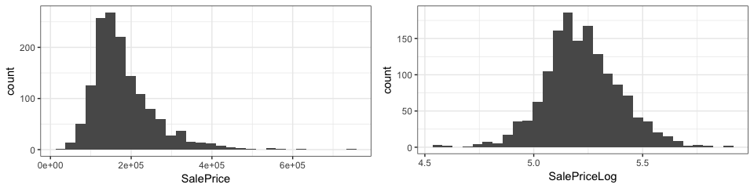

### Numeric variables

Let's get an overview of the numeric variables 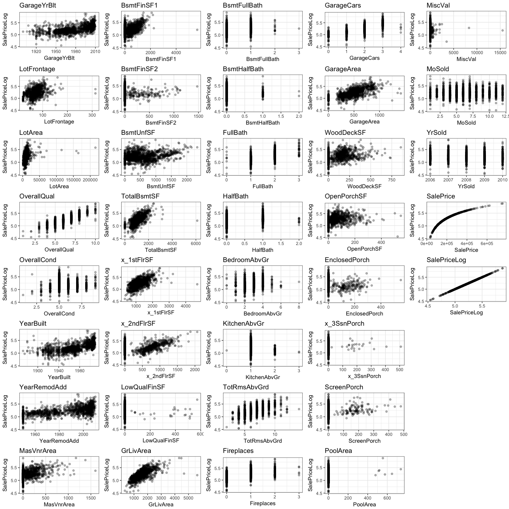 Note the following: Some variables contain outliers. If you are going to do clustering this is imporant to note, because some algorithms are sensitive to outliers. Some variables display a double correlation pattern. This is only visible when you set the points in the plot to be transparent. (Example: TotalBsmtSF, x\_1stFlrSF)

When reading **data\_descr.txt** it is clear that some variables are highly correlated purely by definition. Let's explore those in detail and decide which to keep.

    ##              YearBuilt GarageYrBlt GarageCars GarageArea YearRemodAdd
    ## YearBuilt    1.0000000   0.8256675  0.5233495  0.4449505    0.6180581
    ## GarageYrBlt  0.8256675   1.0000000  0.5889200  0.5645671    0.6422768
    ## GarageCars   0.5233495   0.5889200  1.0000000  0.8314807    0.4506592
    ## GarageArea   0.4449505   0.5645671  0.8314807  1.0000000    0.3823228
    ## YearRemodAdd 0.6180581   0.6422768  0.4506592  0.3823228    1.0000000

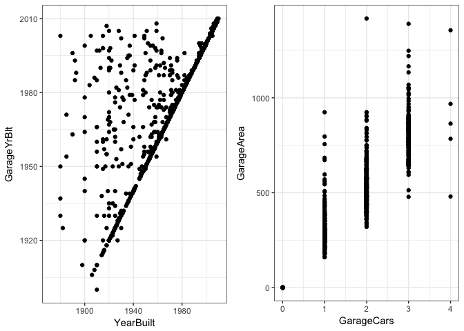 From the above we can see that there is a very high correlation between **YearBuilt** & **GarageYrBlt** as well as **GarageCars** & **GarageArea**. Another point to note is that each of **GarageYrBlt**, **GarageCars** & **GarageArea** indicates the lack of a garage on the property. From here on we will only use**YearBuilt** and **GarageArea** as these variables contains info regarding the age of the property (and garage), if there is in fact a garage and its size.

#### Clustering

It would make sense that bigger houses are more expensive. Let's cluster all area related variables and assess the impact of area on **SalePrice**. Because we know that there are multiple outliers in the data we will use the k-medoids algorithm rather than k-means. We'll also explore hierarchical clustering.

    ## [1] "Hopkins statistic: 0.941106"

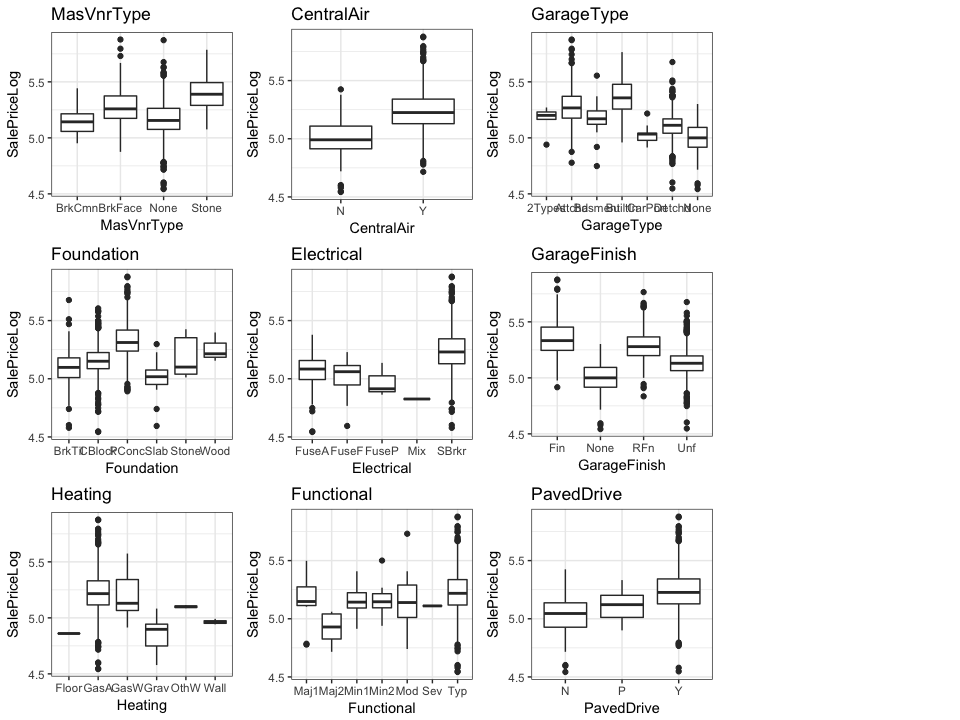 The Hopkins statistic suggest that the data is highly clusterable. Visual inspection is less positive with Pearson showing the most promise.

Let's cluster using PAM with the Pearson distance measure. But first, what is the optimal value of **k**?

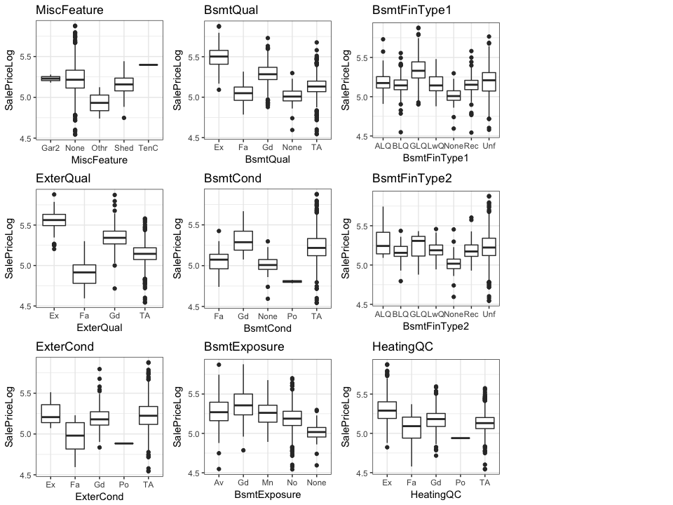 **k** = 2 seems to be the clear favourite, but let's explore **k** = 2,3 as well.

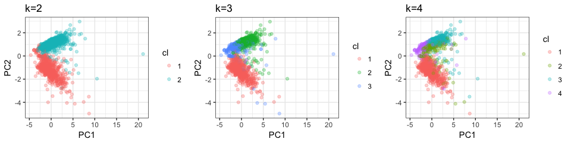

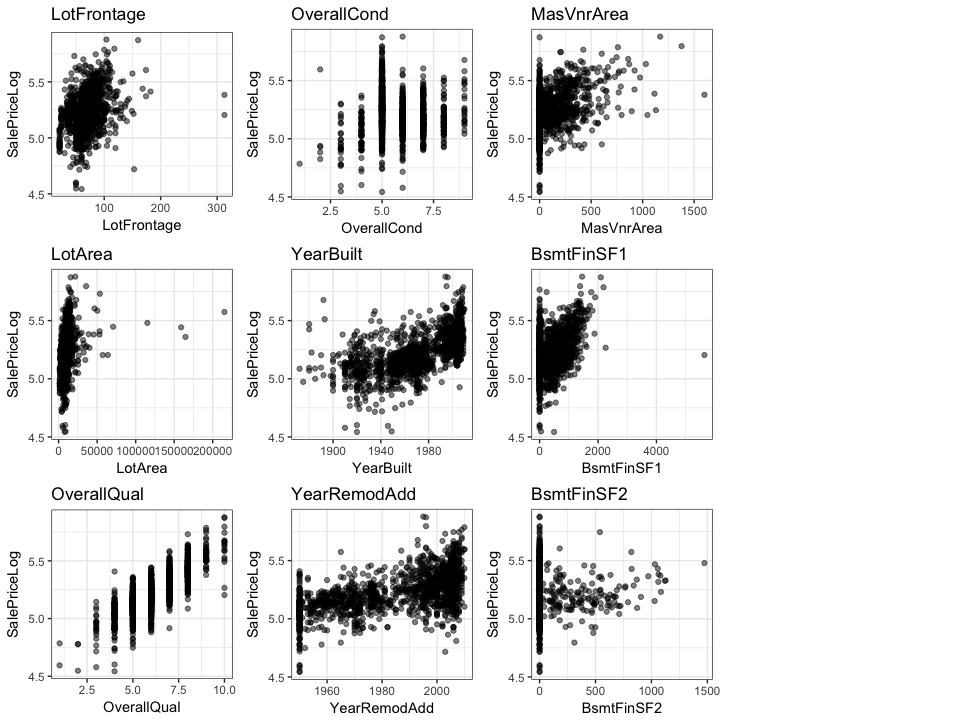

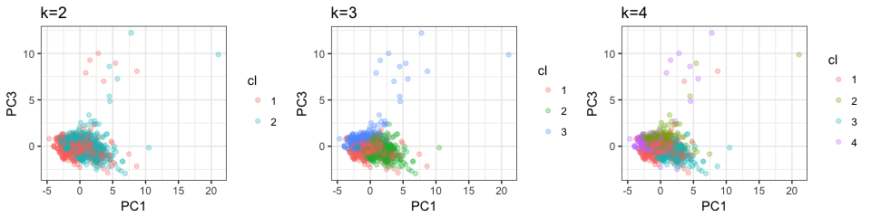

It seems the data naturally splits into 2 clusters.

    ##   cluster size ave.sil.width
    ## 1       1  657          0.47
    ## 2       2  803          0.40
    ##   cluster size ave.sil.width
    ## 1       1  588          0.48
    ## 2       2  473          0.33
    ## 3       3  399          0.24
    ##   cluster size ave.sil.width
    ## 1       1  566          0.45
    ## 2       2  310          0.23
    ## 3       3  326          0.35
    ## 4       4  258          0.25

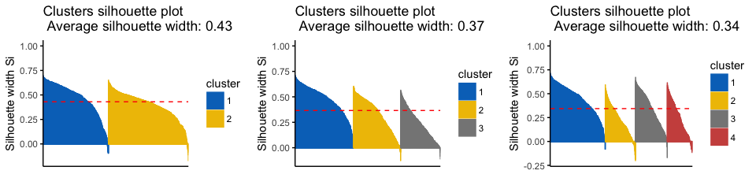 Visual inspection certainly suggest 2 clusters, which is further confirmed by the higher average silhouette width.

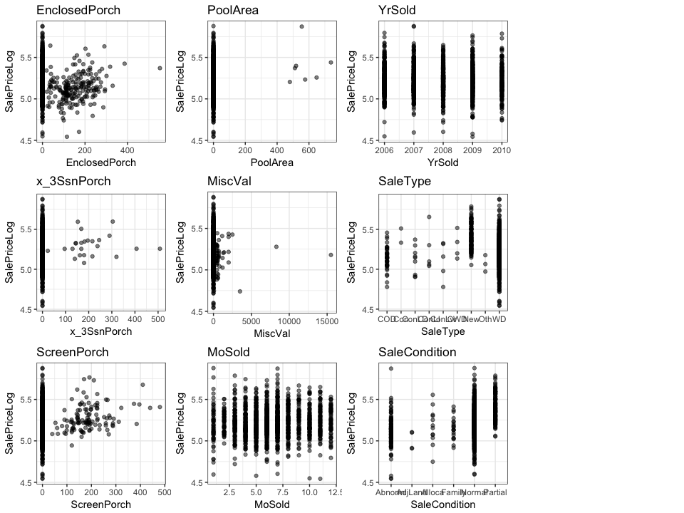

Now, let's have a look at hierarchical clustering

Agglomerative clustering

    ## [1] 0.6830653

    ## [1] 0.5504681

    ## [1] 0.05108344

    ## [1] 0.6772911

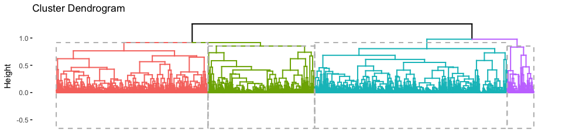
